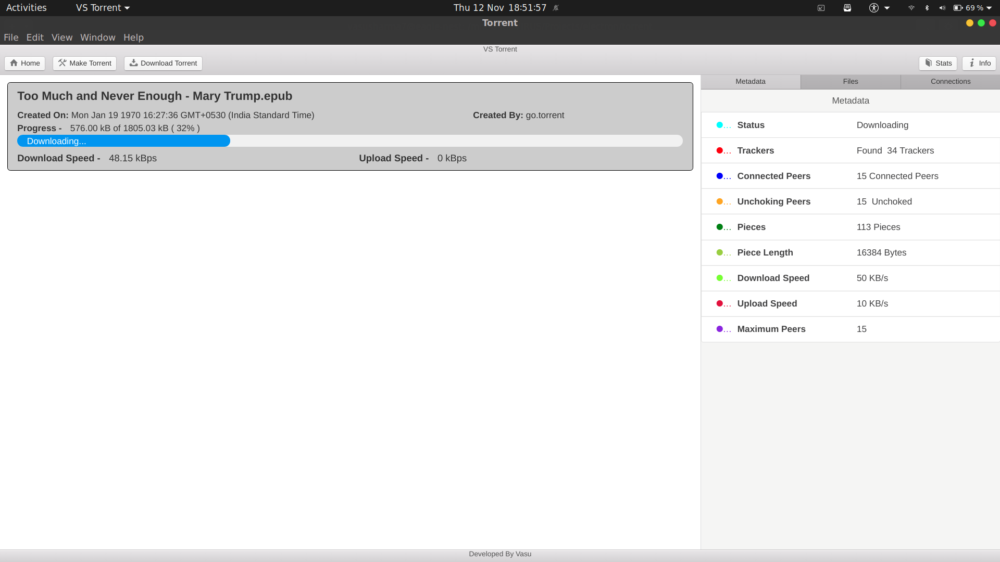

<h1><b> VS Torrent </b></h1> 

<h3><b> BitTorrent Cleint </b></h3> 

**Features**

 - Downloading from Peers and Uploading to Peers
 - Algorithms Implemented - Rarest First, Top Four, Optimistic Unchoke, End-game
 - Seeding
 - Supports seeding across NAT also
 - Download and Upload Speed Control
 - Maximum Peer Connection Control
 - Make New Torrent
 - Supports CLI + GUI
 
 

 

 **Tech Stack Used**
 
  - NodeJS
  - Electron for Native Application (GUI)
  - Electron - Photon framework for GUI Components
  
 

 
------------Requirements------------

1. npm v6 (pref 6.4.1) (sudo apt update && apt install npm)
2. NodeJS v12 (pref 12.8) (sudo apt install nodejs)
3. Electron JS - install globally (npm i -g electron)
----------------Steps to run the code----------
(Can be run in GUI or CLI - either of D or E step to be done)

**Also implemented the functionality of STUN server to get over NAT world using TCP port forwarding and ssh tunneling**
*Take Key by mailing to vasusharma2017@outlook.com* for running seeding across NAT*

**Open Terminal**

A. Install electron GUI dependencies

    > Move to the root folder of project

    > Type npm install

B. Install Torrent dependencies

    > Move to src/torrent-core

    > Type npm install

C.Start ssh-tunnel (Optional - Required during Seeding for connection with PCs across the NAT) (more information at the end)

    > Move to ssh-tunnel folder in root directory of project

    > Execute any of the tunnel*.sh file in Terminal and keep that runnning

        ex. 

        >./tunnel1.sh
            or
        >./tunnel2.sh

        If there is any error in this step, run alternative tunnel file 
        Execution permission may have to be given for .sh files by chmod commands
        ex. 

        chmod +x tunnel1.sh

        Leave this terminal Open for remote connection
D. Run GUI

    >Move to root directory of the project

    >Type electron .

    or 
    >Type npm start

E. Run CLI

    > Open terminal

    >Move to src/torrent-core directory

    **Now there are 2 modes in CLI**

    a. Interactive Shell Mode

        >Type npm run torrent

        >Then the Interactive Session will guide you to the required steps
            (Screenshots present in Screenshots folder in root directory of project)

    b. Arguemnts while running mode

        >Type node index.h -h
        (This will list all the options available for download/ setting options / make torrent etc.)
        

        1. To download torrent - use flags -d and -l 

            >node index.js -d <path_to_torrent_file> -l <location_to_save_downloaded_file>

        2. To set download and upload speed , use  -s and -u flag

            >node index.js -d <path_to_torrent_file> -l <location_to_save_downloaded_file> -s <max_download_speed> -u <max_upload_speed>

        3.To set maximum peers, use flag -c

            >node index.js -d <path_to_torrent_file> -l <location_to_save_downloaded_file> -s <max_download_speed> -u <max_upload_speed> -c <max_connections>

        4. To make torrent, use flags -m,-l,-n,-w

            -n NAME, --name  Name of torrent file to be created
            -m MAKE, --make  Path to File or Folder to make Torrent
            -t TYPE, --type  Type of Torrent To Make - Single File - use -t 0 | Folder - use -t 1
            -l LOCATION, --location 
                                    Path to donwload Torrent or save newly created file
            -w TRACKERURLS, --trackerURLs 
                                    Tracker URLs for making torrent files - comma separated

            >node index.js -m <path_to_torrent_file_or_folder_to_make_torrent> -l <location_to_save_torrent_file> -n <name_of_torrent_file_to_create> -w <tracker_urls_separated_by_comma> -t <0 or 1>

**Additional Feature**

Seeding also works from when the client is run locally - tested with seeding to Azure and AWS from local machine.
Implemented SSH Port Tunneling to achive this, have to follow Step B above for this to work.
Tried to replicate STUN Server kind of functionality

*What I did -*

I have implemented TCP Port forwarding for *raw packets* on  AWS ec2 (with public IP) by building NginX from source and configuring it for tcp-stream options.
Connection requests on 18.225.11.191:6877 are forwarded to 18.225.11.191:5000 on which ssh tunneling is done.
Then used ssh tunneling from localhost:6877 on which VS Torrent is running to port 5000 of AWS machine.
And this way got over NAT.
And I am giving my IP as 18.225.11.191 while contacting tracker so that others , outside NAT network, can contact me as well.

**Reason to choose Node JS over Python**

1.Cross platform native GUI app development is quite easy in Electron - which is a JS Framework.

2. Also,
NodeJS runs asynchronously by default and there is no concept of multi threading in foreground. But all the asynchronous tasks are assigned to the event loop of NodeJS. 
This is even true for V8. The event loop is written in C++ and the good thing is that C++ supports multi threading.
So, conceptually seeing, node-js has C++ code written for running its asynchronous tasks, which spwans multiple threads for running it. 
So, we acheive multi threading without even coding for that. But that is true only for asynchronous tasks like API fetching, Network Oriented Tasks, file system based tasks. Some of the CPU intensive tasks such as calculating hashes in crypto library or image processing takes time because they are synchronous in nature. Node has a solution for that too. Node JS has 4 threads in its thread pool which means that it can actually run 4 synchronous tasks parallely without performance loss but slows down if more than 4 are run together. 
Proportion of C++ code is 1/3 in node , rest is itself JS.

